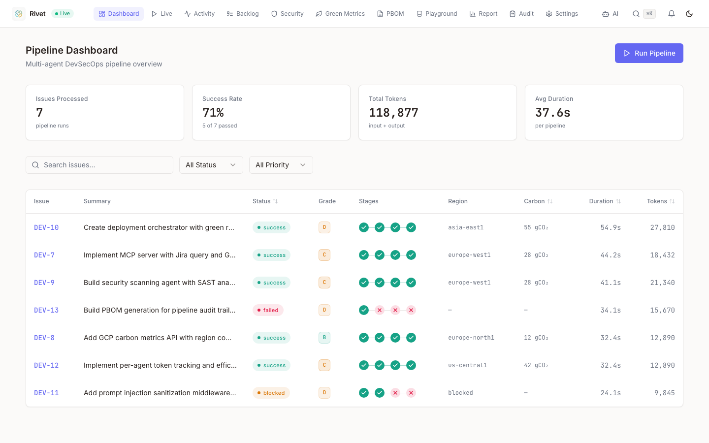
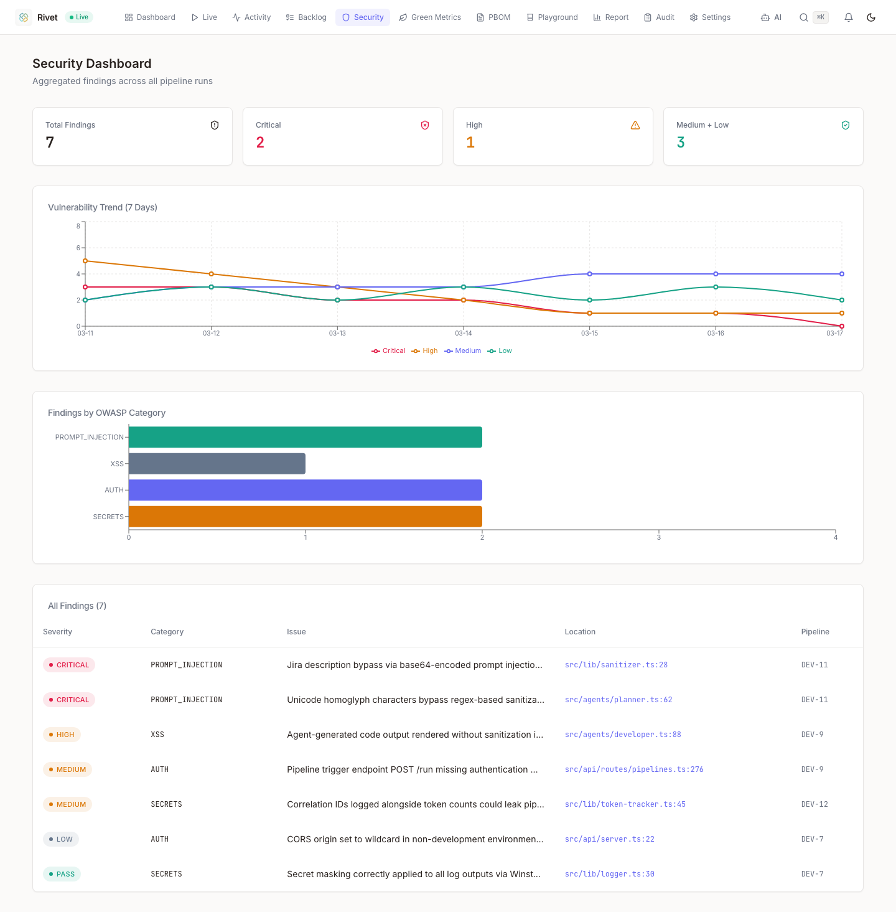
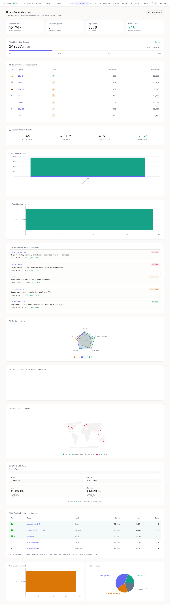

# Rivet — Multi-Agent DevSecOps Flow

**Submission for 2026 GitLab AI Hackathon** (Feb 9 — Mar 25, 2026)

| | |
|---|---|
| **Live Dashboard** | https://d3v07.github.io/rivet/ |
| **Backend API** | https://rivet-api-1094724708022.europe-west1.run.app/api |
| **Jira Board** | https://rivet444.atlassian.net (project: DEV) |

Rivet is a multi-agent DevSecOps pipeline that transforms Jira business requirements into secure, audited, deployed code. Four AI agents handle planning, code generation, security scanning, and carbon-aware deployment — orchestrated through GitLab Duo Agent Platform with no human intervention unless a critical issue is found.

### Pipeline Dashboard


### Security Findings


### Green Agents Metrics


## The Problem: The Verification Gap

AI models can generate thousands of lines of code in seconds. But human-driven verification, security auditing, compliance mapping, and deployment orchestration cannot keep up. This creates bottleneck: either developers manually verify everything (slow), or code ships untested (risky).

Rivet solves this by autonomously handling the entire pipeline:
- **Contextual Planning**: Read unstructured Jira requirements, generate structured execution plans
- **Code Generation**: Write application code via multi-provider LLM integration (Ollama/Gemini/Claude/Vertex)
- **Security Auditing**: Scan code for OWASP vulnerabilities, auto-generate patches
- **Intelligent Deployment**: Query GCP carbon intensity, deploy to lowest-carbon regions
- **Compliance Tracking**: Generate Pipeline Bill of Materials (PBOM) for every run

All without human intervention, unless a critical issue requires manual review.

## Architecture at a Glance

```
[Jira Issue: "Ready for Engineering"]
    ↓
[Contextual Planner Agent] (MCP Client → Jira)
    ↓ (structured execution plan)
[Developer Agent] (LLM: Ollama/Gemini/Claude/Vertex)
    ↓ (committed code)
[Security Analyst Agent] (OWASP scanning)
    ↓ (approved or halted with human review)
[Deployer Agent] (MCP Client → GCP carbon metrics)
    ↓ (deployed to optimal region)
[Pipeline Bill of Materials] (audit trail + metrics)
```

### Core Components

| Component | Purpose | Technology |
|-----------|---------|-----------|
| **MCP Server** | Bridges GitLab Duo agents to external APIs (Jira, GCP) | Node.js, `@modelcontextprotocol/sdk` |
| **GitLab Duo Agents** | Custom agents with task-specific prompts and tool access | GitLab Agent Platform, YAML config |
| **AGENTS.md** | Hierarchical behavioral governance for AI agents | Markdown rules, enforced at runtime |
| **YAML Flow** | Event-driven multi-agent orchestration | `rivet-flow.yaml` |
| **CI/CD Pipeline** | Build, test, security, deploy automation | `.gitlab-ci.yml`, GitLab shared runners |

## Prize Tracks Targeted

| Track | Integration |
|-------|-------------|
| **General Prize Pool** | GitLab Duo Agent Platform, MCP integration, custom agents |
| **Google Cloud + GitLab ($13.5k)** | Carbon-aware deployment via GCP BigQuery + Billing APIs |
| **Anthropic via GitLab ($13.5k)** | Claude Sonnet as LLM provider via `@anthropic-ai/sdk`, token tracking, structured logging |
| **Green Agents ($3k)** | Token efficiency tracking, context window optimization, carbon scoring |

## Getting Started

### Prerequisites

- Node.js 18+
- npm 9+
- Git
- GitLab account (local development works without it)

### Installation

```bash
# Clone the repo
git clone https://gitlab.com/gitlab-ai-hackathon/participants/35312041.git rivet
cd rivet

# Install dependencies
npm ci

# Set up environment variables
cp .env.example .env
# Edit .env with your API keys (see Setup section below)

# Run development server
npm run dev

# Run tests
npm run test

# Build for production
npm run build
```

### Build Commands

```bash
make dev              # Start dev server with watch
make build            # Build TypeScript to dist/
make test             # Run all tests
make test-coverage    # Generate coverage report
make lint             # Run ESLint
make lint-fix         # Auto-fix linting issues
make typecheck        # Type-check without emitting
make mcp-server       # Run MCP server standalone
make ci               # Run full CI pipeline locally
```

## Frontend Dashboard

The React frontend at [d3v07.github.io/rivet](https://d3v07.github.io/rivet/) provides real-time visibility into the pipeline:

| Page | What It Shows |
|------|---------------|
| **Dashboard** | 7 pipeline runs with status, grade, stages, region, carbon, tokens |
| **Security** | Aggregated OWASP findings, vulnerability trends, severity breakdown |
| **Green Metrics** | Token efficiency leaderboard, carbon budget, region comparison, forecast |
| **PBOM** | Expandable audit trail per pipeline — agents, tools, token counts |
| **Backlog** | Live Jira Kanban board (13 issues via Jira REST API) |
| **Audit** | Chronological event log across all pipeline activity |
| **Report** | Sustainability report with carbon equivalences and recommendations |

All data comes from the live Cloud Run API — no mock fallbacks.

## Architecture & Design

### AGENTS.md Governance

All AI agents follow directives defined in the hierarchical AGENTS.md system:

- **Root AGENTS.md**: Global rules (async-first, immutability, least privilege, error handling, testing requirements)
- **mcp-server/AGENTS.md**: Node.js/TypeScript-specific rules (strict types, Zod validation, external API integration patterns)

These rules ensure agents generate code that is:
- **Maintainable**: Functions <50 lines, files <800 lines, clear naming
- **Secure**: Input validation at boundaries, sanitization of LLM inputs, no secrets in logs
- **Auditable**: Structured logging, correlation IDs, human-in-the-loop gates
- **Efficient**: Token tracking, payload optimization, context window budgeting

### MCP Server

The MCP Server exposes tools that agents invoke via the Model Context Protocol:

- **`query_jira_backlog`**: Fetch issues tagged "Ready for Engineering", return sanitized payloads
- **`fetch_gcp_carbon_metrics`**: Query GCP carbon intensity per region
- **`get_compute_pricing`**: Query GCP spot/on-demand pricing by region

All tool responses are sanitized against prompt injection patterns before returning to the agent context.

### Multi-Agent Flow

The orchestration flow is defined in `rivet-flow.yaml`:

1. **Event Trigger**: Issue labeled "Rivet-Execute" → flow starts
2. **Planner Stage**: Reads Jira issue, cross-references AGENTS.md, produces structured JSON execution plan
3. **Developer Stage**: Consumes plan, generates code via LLM (Ollama/Gemini/Claude/Vertex), commits to feature branch
4. **Security Stage**: Scans committed code, auto-patches fixable issues, blocks critical vulnerabilities
5. **Deployer Stage**: Analyzes GCP carbon/pricing, selects optimal region, deploys
6. **Fallback**: If security or deployment fails, creates human-review issue with full context

### Security Infrastructure

- **Composite Identity & Least Privilege**: Each agent has a dedicated service account with minimal scopes
- **Tool Output Sanitization**: All MCP responses are stripped of prompt injection patterns
- **Remote Execution Sandboxing**: Dev Container spec for untested code execution
- **Human-in-the-Loop Gates**: Production merges and deployments require manual approval
- **Pipeline Bill of Materials (PBOM)**: JSON artifact documenting every pipeline run (runner image, agent versions, tool invocations, timestamps, actor)

### Green Agents Optimization

Token efficiency is tracked per-agent and per-pipeline:

- **Payload Optimization**: Jira/GCP responses stripped of bloat (>50% reduction targeted)
- **Context Window Budgeting**: Warn if any agent invocation exceeds 30k tokens
- **Carbon Scoring**: Deploy to lowest-carbon region within latency bounds
- **Metrics Report**: Aggregated per-pipeline statistics (total tokens, cost, carbon, latency)

## Documentation

- **AGENTS.md**: Global AI agent governance and rules
- **mcp-server/AGENTS.md**: Node.js/TypeScript-specific patterns
- **docs/architecture.md**: Detailed system design
- **docs/video-script.md**: 3-minute demo video script
- **docs/qa-checklist.md**: QA testing checklist with all endpoints
- **docs/submission-checklist.md**: Submission preparation

## Testing

```bash
# Run all tests
npm run test

# Run with coverage report
npm run test:coverage

# Run tests with UI
npm run test:ui

# Run specific test file
npm run test src/__tests__/agents/planner.test.ts
```

Coverage target: **80% minimum** (100% for auth, security-critical code)

## Deployment

The system deploys to **Google Cloud Platform** via Cloud Run or GKE, selected based on:
1. Carbon intensity metrics (prefer lowest-carbon regions)
2. Compute pricing (prefer spot instances where available)
3. Latency requirements (stay within configured SLA)

The Deployer Agent handles region selection, config generation, and pipeline trigger—all autonomously.

## Contributing

This is a hackathon submission. Contributions are not accepted during the competition. After judging, this project may be made available under an open license.

## License

MIT — see [LICENSE](LICENSE)

## Acknowledgments

This project leverages:
- **GitLab Duo Agent Platform** — foundational multi-agent orchestration
- **Multi-provider LLM integration** (Ollama, Gemini, Claude, Vertex AI) — code generation and reasoning
- **Google Cloud Platform** — infrastructure and carbon data
- **Model Context Protocol** — secure external API integration

---

**"You Orchestrate, AI Accelerates."** — GitLab AI Hackathon 2026
